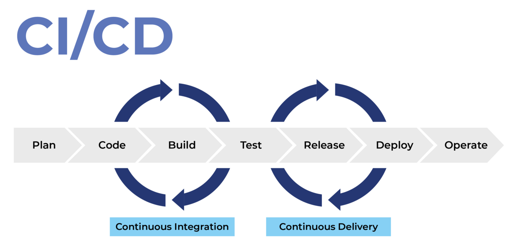
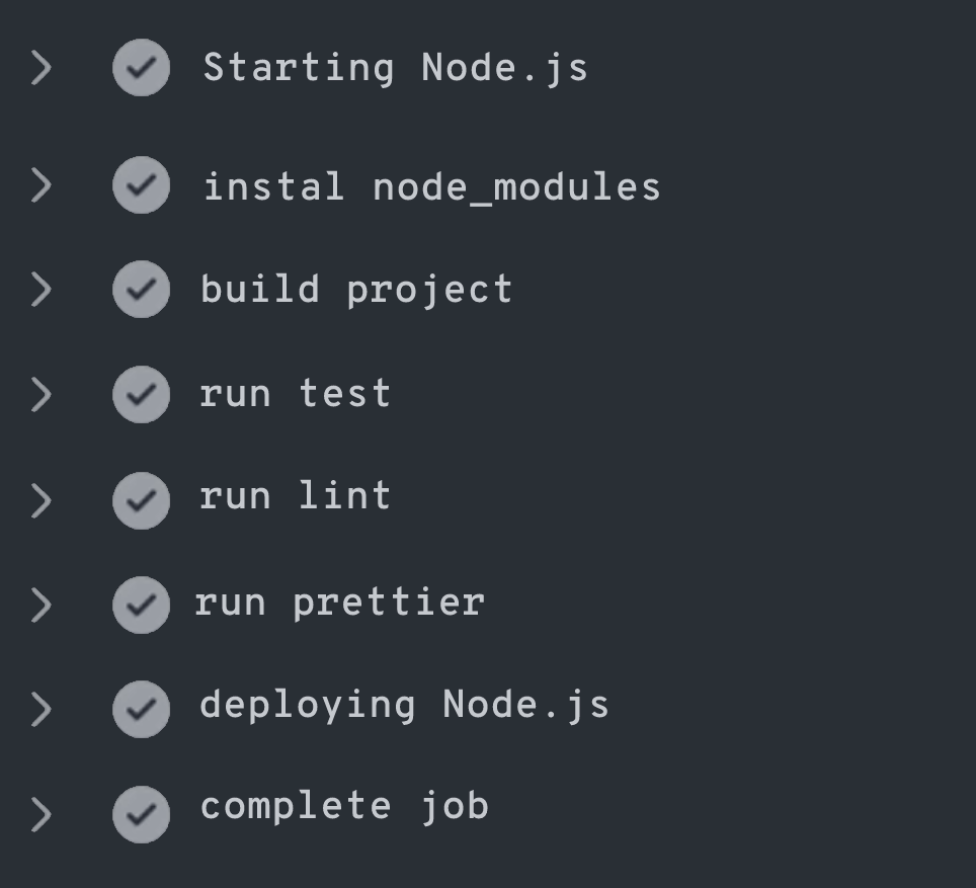
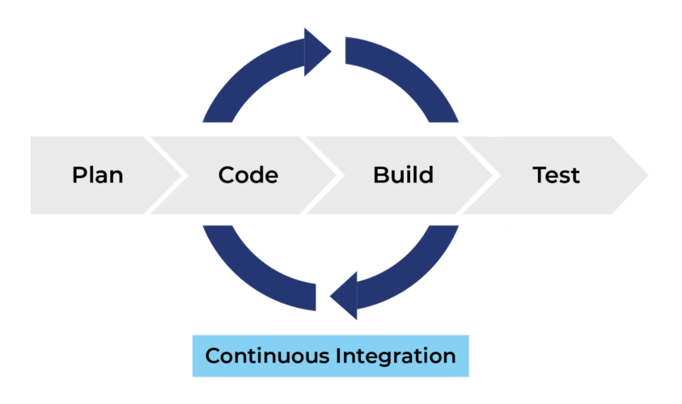
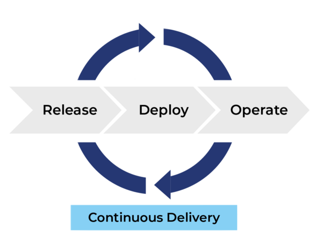
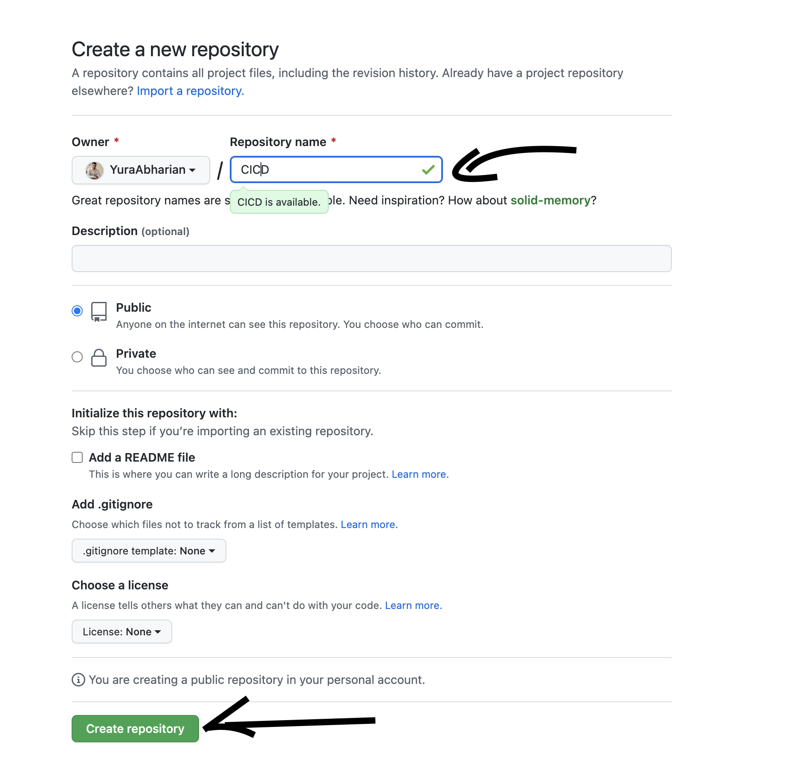
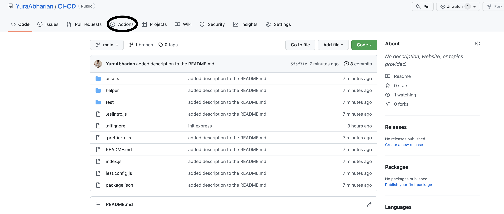

Привет, сегодня бы я хотел показать вам простой пример построения CI/CD пайплайна.

## Что в себя включает CI/CD pipeline можно посмотреть на рисунке приведенном ниже?

<div align="center">
    <figure>
        
        <figcaption>Изображение №1: CI/CD pipeline</figcaption>
    </figure>
</div>

### Сам термин <b>`CI/CD`</b> - переводится как <b>CI - Continuous integration</b> и <b>CD - Continuous delivery</b>;

## Как это работает?

Давайте допустим, что вы получили задачу реализовать какой-то функционал.
Вы откололись от главно ветки (в основном это `main` или `master`) зависит от проекта,
и потом вносите свой код, после того как вы завершили написание пока,
вы делаете `Pull Request` (дальше в статье будет сокращение `PR`) и отдаете его на `Code Review`.
Давайте допустим, что ваш PR прошел проверку и получил approve и теперь может быть смержен в мастер.
Но есть одно, но, во время `Code Review` мы можем гарантировать только качество кода,
и не можем гарантировать, что новые не сломают всю систему.

## Как же нам гарантировать, что изменения не сломают приложение?

Один из вариантов это:

- Собрать приложение (`build`);
- Прогнать тесты (`run test`);
- Проверить качество кода (`run linter` | `run prettier` | `run type check`)

Как видите тут не мало действий, и очень легко забыть или упустить какой-то шаг.
И если такое произойдет то новые изменения могут сломать ваше приложение.
Особенно на проектах где есть много проверок. И, конечно же, было бы лучше автоматизировать этот процесс.

## Когда стоить запускать проверку?

Думаю хорошим вариантом было бы, чтобы проверки проходили при создании `PR`,
и что бы разработчик, который будет проводить `Code Review` видел, прошел ли этот `PR` тесты или нет.
И чтобы мы не могли вмержить наш код в `master`, если код не прошел все проверки.
Будьте аккуратны и не забудьте добавить эту проверку.

<div align="center">
    <figure>
        
        <figcaption>Изображение №2: CI/CD job</figcaption>
    </figure>
</div>

## Какие плюсы это дает разработчику?

Разработчик еще на этапе создания `PR` увидит свои ошибки и сможет их поправить,
что сэкономит время другим членам команды, а это очень ВАЖНО!

## First milestone Мы с вами разобрали процесс Continuous integration

<div align="center">
    <figure>
        
        <figcaption>Изображение №3: CI diagram</figcaption>
    </figure>
</div>

## Как работает Continuous delivery?

Тут все немного проще, когда все тесты прошли и твой `PR` просмотрели, то мы можем мержить нашу ветку в `master`,
вторым шагом будет сборка нашего приложения и третий шаг будет разворачивание нашего приложения
на продакшн или тестовом энвайрнменте.

<div align="center">
    <figure>
        
        <figcaption>Изображение №4: CD diagram</figcaption>
    </figure>
</div>

## Теперь давайте приступим к практике и посмотрим как это работает!

Первым, что нужно сделать это инициализировать проект.
Я создал пустую папку, потом в ней `npm init`, чтобы инициализировать `package.json`
и установить express `npm i express`, `npm i -D @types/express`.
Затем создал index.js и создал там наш сервер.

```javascript
const express = require('express')
const app = express()

app.get('/', function (req, res) {
  res.send('Hello World')
})

app.get('/test', function (req, res) {
  res.send('Hello World')
})

const PORT = 3000
app.listen(PORT, () => {
  console.log('TEST APP IS APP ON PORT:', PORT)
})
```

Code from `index.js`

After you've prepared everything you can create [a new GitHub repository](https://github.com/new)

<div align="center">
    <figure>
        
        <figcaption>Изображение №5: Create a new repository</figcaption>
    </figure>
</div>

After you have created a new repository we can start to configure CI pipeline.
Go to your new repository and then to the Actions tab

<div align="center">
    <figure>
        
        <figcaption>Изображение №6: Actions tab</figcaption>
    </figure>
</div>

Then follow this [link](https://docs.github.com/en/actions/quickstart) and
